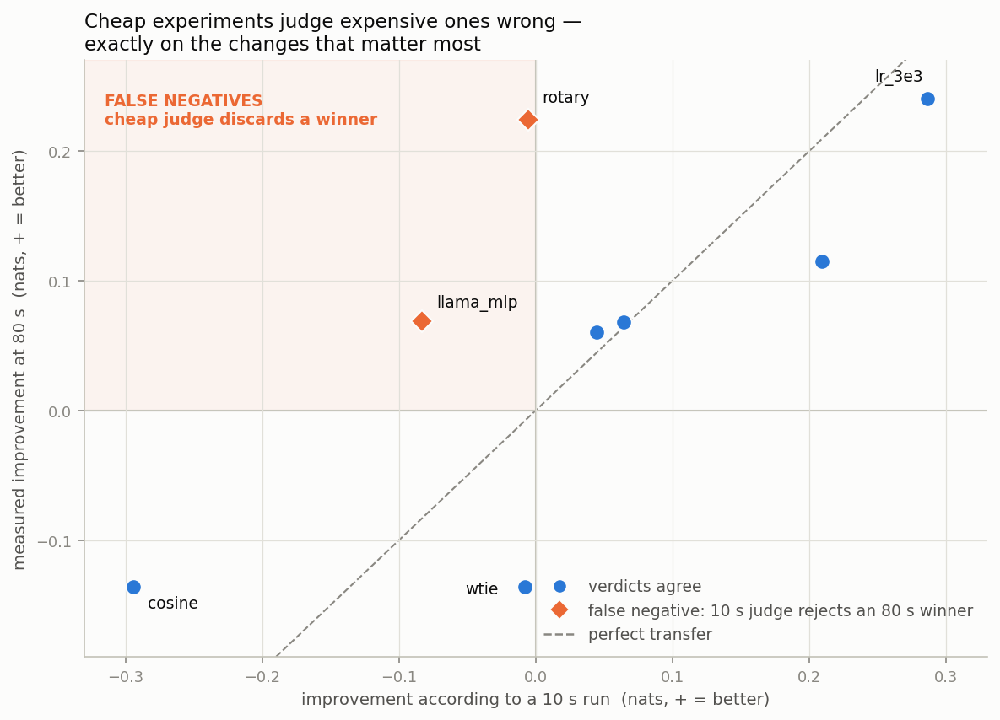
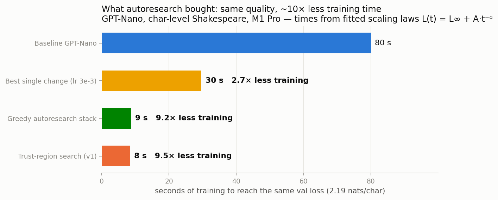
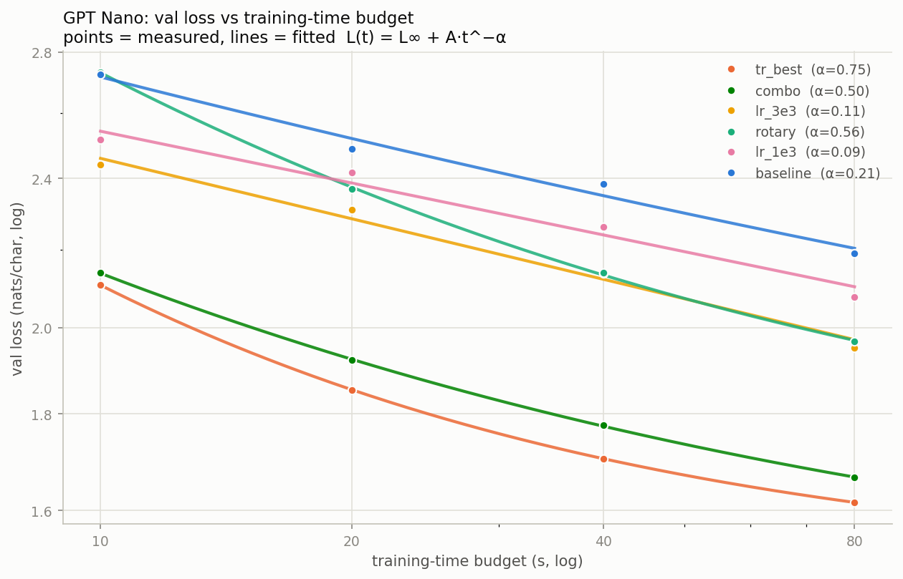

# Autoresearch needs trust regions

Automated ML research loops test ideas with **cheap** training runs and keep
what wins, assuming cheap verdicts transfer to the **expensive** model you
actually care about. We made that assumption measurable on a laptop-scale
testbed — GPT-Nano (3 layers / 3 heads / 48-dim, char-level Shakespeare)
under wall-clock training budgets of 10–80 s — and it fails, structurally:



The 10-second judge inverts on exactly the changes that matter most: rotary
embeddings look like a regression at 10 s and are the second-most-valuable
change at 80 s (worth 4× training time). The failure runs both directions —
inside a live campaign, the cheap surrogate endorsed a candidate as +0.008
better that replicated truth measured −0.004 *worse*
([both panels](results/counterexample.png)). And at real campaign step
sizes, 1-seed decisions sit inside the measured noise floor (sd ≈ 0.0095
nats): the naive loop's accepts are coin flips.

## The fix: borrow the trust region from nonlinear optimization

Only trust the cheap signal inside a region where it keeps earning trust:

```
surrogate  m(x) = 20 s + 40 s runs → power-law extrapolation L(t) = L∞ + A·t⁻ᵅ
region     d(x, x_k) ≤ Δ, distance in *behavioral nats*: measured per-dim
           sensitivities + per-flag exchange rates (a rotary flip "costs"
           2.31 lr-doublings) — fitted from our own logs (fit_metric.py)
ratio      ρ = actual improvement / predicted improvement
accept     only if replicated improvement ≥ max(0.05·Δ², 95% CI) — so every
           accepted step is real with high probability, whatever the surrogate did
update     ρ good → grow Δ; over-promise / noise → shrink Δ
```

The guarantee attaches to the *acceptance test*, not the surrogate — the
proposer can be random draws (it is) or an LLM without touching correctness.
Exact theorems, conditions, and costs: [THEORY.md](THEORY.md) (adversarially
verified against primary sources).

## Results

**Replicated verdict** (val loss @ 80 s, fresh seeds — the noise-robust numbers):

| recipe | mean ± sd (n) | vs greedy |
|---|---|---|
| baseline GPT-Nano | 2.191 (1) | — |
| greedy autoresearch stack | 1.6615 ± 0.0114 (7) | — |
| trust-region v1 (uncertified accepts) | **1.6327** ± 0.0169 (5) | z ≈ 3.3 |
| trust-region v2 (certified accepts) | 1.6489 ± 0.0060 (3) | z ≈ 2.3 |

Both trust-region campaigns beat the greedy stack. The quantified trade-off:
v1's noise-sized bets compounded into more ground (Δ ≈ 0.016, z ≈ 2.0 over
v2); v2 paid part of its budget for certificates — it skipped confirms the
surrogate couldn't justify (v1 wasted 5/6 there), caught the false positive
above, made one certified accept (+0.0158 ≥ threshold 0.0125, paired seeds),
and closed by certifying 1-flip local optimality. Full decision logs:
`results/tr_log.md`, `results/tr2_log.md`.

**What the search bought**, as time-to-match-quality (solve each fitted
scaling law for the training time reaching baseline's 80 s loss):



**The scaling laws themselves** — improvements don't just shift the curve,
they steepen it (α 0.21 → 0.75); two folklore staples *hurt* at these
budgets (cosine LR decay, weight tying):



## Reproduce

```bash
python3 -m venv .venv && source .venv/bin/activate
pip install -r requirements.txt        # torch, numpy, scipy, matplotlib

python train.py --variant baseline --budget 20          # one run
python sweep.py --variants baseline,lr_3e3 --budgets 10,20,40,80
python analyze.py                                       # fits + scaling.png
python trust_region_v2.py --iters 5 --candidates 4 --reps 2 --poll
python fit_metric.py                                    # the learned metric
```

Data is committed (tiny Shakespeare); no downloads, no API keys, no LLM in
the loop (`autoresearch.py --claude` optionally asks the `claude` CLI for
candidates — off by default). Seeded throughout, but budgets are wall-clock
and MPS is not bitwise deterministic: same-config runs vary ±0.01, so expect
qualitative results to reproduce exactly and losses to wiggle; the verdict
table above is the noise-robust reference. Figures regenerate from committed
data: `python analyze.py && python make_headline.py && python make_counterexample.py`.

## Map

| | |
|---|---|
| `model.py`, `train.py`, `variants.py`, `sweep.py` | GPT-Nano + time-budgeted training + candidate registry |
| `trust_region.py` / `trust_region_v2.py` | the two campaign loops (v2 = learned metric + certified acceptance) |
| `analyze.py`, `fit_metric.py`, `make_*.py` | scaling-law fits, metric estimation, figures |
| [`THEORY.md`](THEORY.md) | when is this provably convergent, and at what cost |
| `results/` | all runs (JSONL), decision logs, report, figures |

## Related

[karpathy/autoresearch](https://github.com/karpathy/autoresearch) (agent
iterates at one fixed budget, verdicts trusted as rendered) · [Automated LLM
Speedrunning Benchmark](https://arxiv.org/abs/2506.22419) · [Prime Intellect
auto-nanogpt](https://www.primeintellect.ai/auto-nanogpt) · trust-region
lineage: Conn–Gould–Toint, STORM, ASTRO-DF, StoMADS, TuRBO (full list in
THEORY.md).
